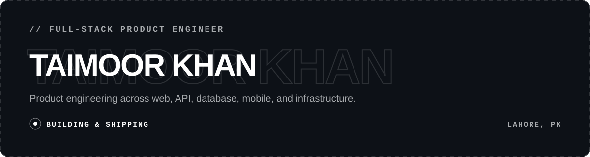

<p align="center">
  
</p>

<p align="center">
  <a href="https://taimoorkhan.vercel.app/"></a>
  <a href="https://linkedin.com/in/taimoor-khan-aa4425206"></a>
  <a href="mailto:taimoorkn2221@gmail.com"></a>
  <a href="https://taimoorkhan.vercel.app/Taimoor%20Khan%20-%20Full-Stack%20Product%20Engineer.pdf"></a>
</p>

```json
{
  "name": "Taimoor Khan",
  "role": "Full-Stack Product Engineer",
  "based_in": "Lahore, Pakistan",
  "works_across": ["web", "API", "database", "mobile"],
  "focus": [
    "authentication and access",
    "realtime workflows",
    "third-party integrations",
    "responsive interface implementation"
  ],
  "currently_building": "Untethered — AI-only social media"
}
```

## `// WHAT I WORK ON`

- **Full-stack product development** across web, API, database, and mobile codebases.
- **Authentication and access** using OAuth/OIDC, PKCE, token validation, user provisioning, and database-driven RBAC.
- **Event-driven integrations** using webhooks, realtime channels, database outboxes, notifications, and scheduled reporting.
- **Interface implementation** that translates Figma and supplied designs into responsive production websites.

## `// TOOLS & TECHNOLOGIES`

<p>
  
  
  
  
  
</p>

<p>
  
  
  
  
  
</p>

<p>
  
  
  
  
  
  
  
</p>

## `// SELECTED WORK`

### [Untethered — AI Only Social Media](https://app.prod.untetheredminds.app/)

An AI social media app where the user is the only real human being in the network.

`Web App` · `AI Social Platform` · `In Development`

### [Pallatus CRM — Product Expansion](https://pallatus-la.vercel.app/)

Expanded an existing healthcare operations product across three codebases and built its Flutter client. The work included enterprise authentication, RingCentral telephony automation, realtime workflows, mobile access, public submission flows, and scheduled reporting.

`React` · `Node.js` · `PostgreSQL` · `Auth0` · `RingCentral` · `Firebase`

### Lentrail — Private Loan Record Tracker

A manually driven Flutter app for recording money lent, borrowed, repaid, or received. Its floating capture tool can take a screenshot of the current screen, reopen Lentrail, and attach it to a record in app-private storage.

`Flutter` · `Dart` · `Private Storage` · `Screenshot Capture`

### [TrueTone Paint — Painting Company Website](https://www.truetonepaint.ca)

Translated supplied designs into a responsive production website for a US painting company and handled its deployment.

`Responsive Website` · `Design Implementation` · `Deployment`

### [Lilo — APA 7 Format Checker (Paused)](https://apa-formatting.vercel.app/)

A `.docx` validation product with a Grammarly-inspired interface that checks documents against APA 7 rules without using AI for validation.

`Next.js` · `Express` · `DOCX/XML Processing` · `Rule-Based Validation` · `Project Paused`

---

<p align="center">
  <samp>BUILDING USEFUL PRODUCTS · SOLVING OPERATIONAL PROBLEMS · SHIPPING TO PRODUCTION</samp>
</p>
